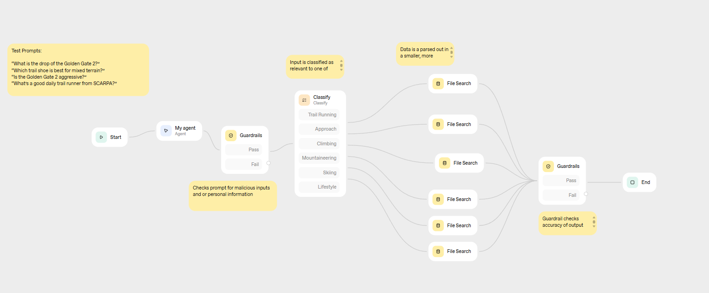

# SCARPA RAG Agent
**Learning Project | Retrieval-Augmented Generation | ChatGPT Agent Builder**

A hands-on learning project: a **RAG (Retrieval-Augmented Generation)** agent built in **ChatGPT's Agent Builder** that answers natural-language product questions across SCARPA's footwear lineup.

The goal was to understand how agent workflows actually behave — **RAG, prompt classification, guardrails** — by building one and watching it run, not by reading about them.

---

## Table of Contents
- [What I Built](#-what-i-built)
- [What I Took Away](#-what-i-took-away)
- [Why I Stopped Here](#-why-i-stopped-here)
- [Stack](#-stack)
- [Repository](#-repository)
- [Disclaimer](#-disclaimer)

---

## 🧱 What I Built

Using ChatGPT's Agent Builder, I designed and tested a six-stage workflow:



The agent takes a natural-language question, routes it through an input guardrail, classifies it into one of six product categories, queries a category-specific vector database, runs an output guardrail check, and returns the answer.

Conceptually:



| Step | Component | What it does |
|------|-----------|--------------|
| 1 | Prompt entry | User submits a natural-language question |
| 2 | Input guardrail | Screens for PII, jailbreak attempts, and prompt injection |
| 3 | Classifier | Routes the prompt to one of six product categories |
| 4 | Vector DB search | Queries the category-specific database |
| 5 | Output guardrail | Checks the answer for faithfulness to retrieved data |
| 6 | Delivery | Validated response returned to the user |

SCARPA's product catalogs were converted into markdown and loaded into six separate vector stores — one per category — rather than a single combined index.

### Product categories

| Category | Example query |
|----------|--------------|
| Trail Running | "What's the drop on the Golden Gate 2?" |
| Approach | "Which shoe is best for mixed terrain?" |
| Climbing | "Is the Instinct S aggressive?" |
| Mountaineering | "How does the Ribelle compare to the Phantom?" |
| Skiing | "What's the flex index on the Maestrale RS?" |
| Lifestyle | "What's a versatile everyday SCARPA option?" |

---

## 🧠 What I Took Away

The architecture was the starting point. The interesting part was working through *why* it has to look that way.

**Retrieval-Augmented Generation.** Grounding LLM output in retrieved external data rather than the model's parametric memory. The agent answers from the catalog, not from what the model thinks it knows about SCARPA. That distinction reframes a lot of LLM behavior.

**Context pollution.** More retrieved context isn't automatically better. Irrelevant or loosely-related chunks compete with the right information and degrade answer quality. Sharding by category isn't just an optimization — it's a way of protecting the model from itself.

**Probabilistic retrieval and generation.** LLMs don't "look up" answers and vector search doesn't "find" them. Both stages are similarity-based probability work. Treating either as deterministic is one of the quieter ways to ship something that fails unpredictably.

**Classification as a routing layer.** Sending the query to the right index *before* retrieval is what makes sharding pay off. Without classification, the sharding is wasted.

**Guardrails at both ends.** Input guardrails screen what comes in. Output guardrails verify the answer didn't drift from the retrieved data. Different failure modes, different checks.

---

## 🛑 Why I Stopped Here

ChatGPT's Agent Builder is a workflow modeling and prototyping environment — not a deployment platform. Pushing this past the build-and-test stage would have meant rebuilding the same workflow outside Agent Builder against a different stack, which would have been a deployment exercise rather than a learning one.

The conceptual goal was met when I could submit a prompt, watch it route through the classifier, hit the correct vector store, and return a validated answer. Further work would have produced diminishing returns against what I set out to learn.

**Update — June 2026:** OpenAI has since announced it's winding down Agent Builder (along with Evals), with shutdown scheduled for November 30, 2026; it now points production workflows to the [Agents SDK](https://github.com/openai/openai-agents-python). That reinforces the reasoning above — Agent Builder was the right environment to *learn* these concepts, not to deploy them. The takeaways (RAG, classification, guardrails) are stack-agnostic and carry over to the SDK or any other orchestration layer.

---

## 🔧 Stack

| Tool | Purpose |
|------|---------|
| ChatGPT Agent Builder | Workflow design and orchestration |
| Vector stores (×6) | Category-specific semantic search |
| Markdown | Product catalog format |

---

## 📁 Repository

```
scarpa-rag-agent/
├── README.md
├── data/                                 # Six markdown product catalogs
└── assets/
    ├── workflow.png                      # Agent Builder screenshot
    └── scarpa_agent_architecture.svg     # Conceptual flow diagram
```

---

## 📄 Disclaimer

This is a personal learning project built to explore RAG and agent workflow concepts. It is not affiliated with, endorsed by, or sponsored by SCARPA.

Product names, descriptions, and specifications in `data/` are the intellectual property of SCARPA S.p.A. and are included here solely for educational and portfolio purposes. The product data is not licensed for redistribution or commercial use.

The workflow design, architecture, and accompanying documentation are my own work.
